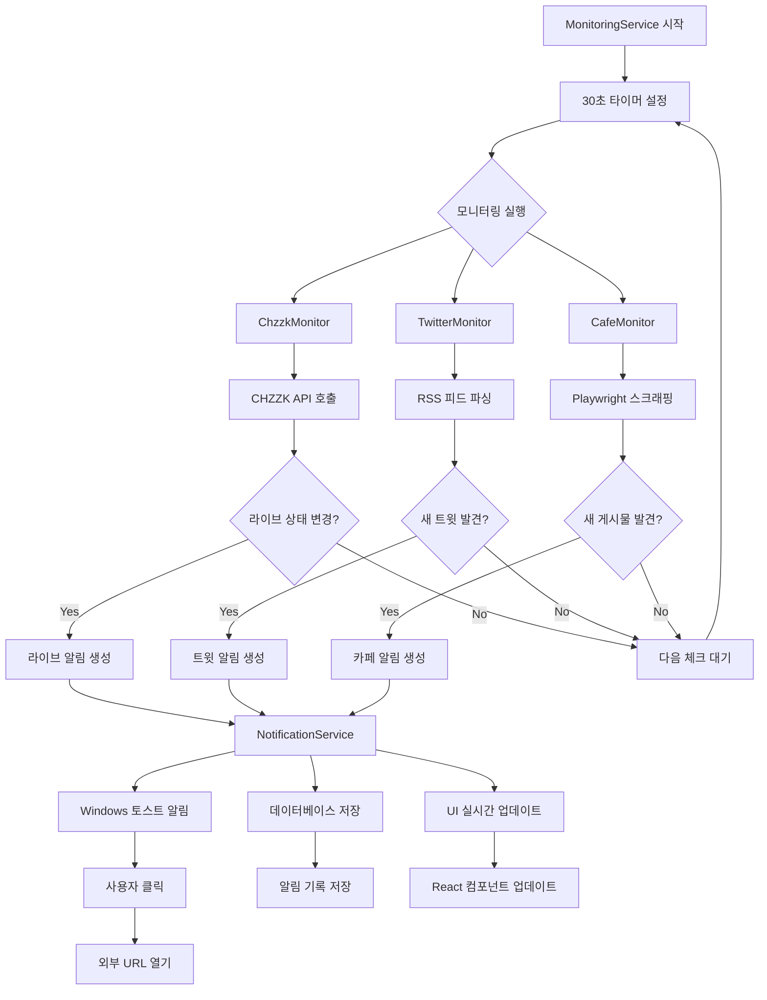
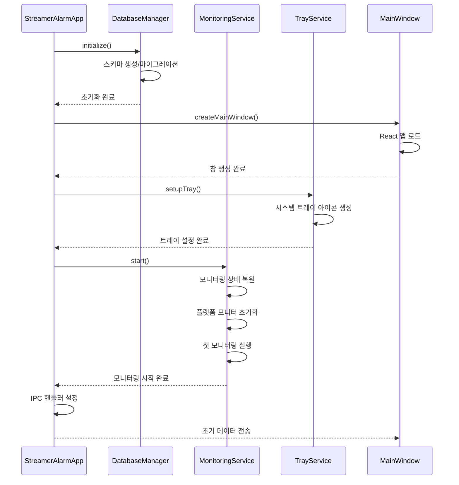
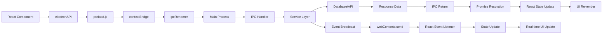

# 🏗️ Streamer Alarm System v2.0 - 시스템 아키텍처

## 📋 목차
- [시스템 개요](#-시스템-개요)
- [아키텍처 다이어그램](#-아키텍처-다이어그램)
- [주요 컴포넌트](#-주요-컴포넌트)
- [데이터 흐름](#-데이터-흐름)
- [기술 스택](#-기술-스택)
- [IPC 통신 아키텍처](#-ipc-통신-아키텍처)
- [데이터베이스 설계](#-데이터베이스-설계)
- [보안 아키텍처](#-보안-아키텍처)
- [성능 최적화](#-성능-최적화)
- [개발 및 배포](#-개발-및-배포)

---

## 🎯 시스템 개요

Streamer Alarm System v2.0은 **Electron 28.1.0** 기반의 크로스 플랫폼 데스크톱 애플리케이션으로, 한국 VTuber 스트리머들의 활동을 실시간으로 모니터링하고 즉시 알림을 제공하는 시스템입니다.

### 🔧 핵심 아키텍처 특징
- **멀티 프로세스 아키텍처**: Main Process(백엔드) + Renderer Process(프론트엔드)
- **마이크로서비스 패턴**: 9개의 독립적이고 특화된 서비스
- **실시간 모니터링**: 30초 간격 병렬 모니터링
- **이벤트 기반 통신**: IPC를 통한 프로세스 간 실시간 데이터 교환
- **안전한 브라우저 자동화**: Playwright를 통한 격리된 브라우저 세션

### 🎨 디자인 원칙
- **장애 격리**: Promise.allSettled로 각 플랫폼 독립적 처리
- **상태 지속성**: SQLite를 통한 안정적인 데이터 저장
- **사용자 경험**: 글래스모피즘 디자인 + 네온 테마
- **보안 우선**: Context isolation + 노드 통합 비활성화

---

## 🏗️ 아키텍처 다이어그램

### 📊 시스템 전체 구조
```
┌─────────────────────────────────────────────────────────────────────────────┐
│                          🖥️ Electron Application                           │
├─────────────────────────────────────────────────────────────────────────────┤
│                                                                             │
│  ┌──────────────────────────┐    ┌──────────────────────────────────────┐  │
│  │    🎨 Renderer Process    │    │         🔧 Main Process              │  │
│  │                          │    │                                      │  │
│  │  ┌─────────────────────┐  │    │  ┌─────────────────────────────────┐  │  │
│  │  │   React 18.2.0      │  │◄──►│  │    StreamerAlarmApp             │  │  │
│  │  │   + TypeScript      │  │    │  │    (Application Core)           │  │  │
│  │  │   + Tailwind CSS    │  │    │  └─────────────────────────────────┘  │  │
│  │  └─────────────────────┘  │    │                                      │  │
│  │                          │    │  ┌─────────────────────────────────┐  │  │
│  │  ┌─────────────────────┐  │    │  │        🔄 Service Layer         │  │  │
│  │  │   UI Components     │  │    │  │                                 │  │  │
│  │  │   - StreamerCard    │  │    │  │  ┌─────────────────────────────┐  │  │
│  │  │   - Sidebar         │  │    │  │  │    MonitoringService        │  │  │
│  │  │   - Settings        │  │    │  │  │    (Orchestrator)           │  │  │
│  │  └─────────────────────┘  │    │  │  └─────────────────────────────┘  │  │
│  └──────────────────────────┘    │  │                                 │  │  │
│                                  │  │  ┌─────────────────────────────┐  │  │
│                                  │  │  │      Platform Monitors      │  │  │
│                                  │  │  │                             │  │  │
│                                  │  │  │  ┌─────────────────────────┐  │  │
│                                  │  │  │  │    ChzzkMonitor         │  │  │
│                                  │  │  │  │    (CHZZK API)          │  │  │
│                                  │  │  │  └─────────────────────────┘  │  │
│                                  │  │  │                             │  │  │
│                                  │  │  │  ┌─────────────────────────┐  │  │
│                                  │  │  │  │    TwitterMonitor       │  │  │
│                                  │  │  │  │    (RSS Parser)         │  │  │
│                                  │  │  │  └─────────────────────────┘  │  │
│                                  │  │  │                             │  │  │
│                                  │  │  │  ┌─────────────────────────┐  │  │
│                                  │  │  │  │    CafeMonitor          │  │  │
│                                  │  │  │  │    (Playwright)         │  │  │
│                                  │  │  │  └─────────────────────────┘  │  │
│                                  │  │  └─────────────────────────────┘  │  │
│                                  │  │                                 │  │  │
│                                  │  │  ┌─────────────────────────────┐  │  │
│                                  │  │  │      Support Services       │  │  │
│                                  │  │  │                             │  │  │
│                                  │  │  │  • DatabaseManager          │  │  │
│                                  │  │  │  • NotificationService      │  │  │
│                                  │  │  │  • SettingsService          │  │  │
│                                  │  │  │  • TrayService              │  │  │
│                                  │  │  │  • StreamerSearchService    │  │  │
│                                  │  │  └─────────────────────────────┘  │  │
│                                  │  └─────────────────────────────────┘  │  │
│                                  └──────────────────────────────────────┘  │
│                                                                             │
├─────────────────────────────────────────────────────────────────────────────┤
│                            🗄️ Data Layer                                   │
│                                                                             │
│  ┌──────────────────────────┐    ┌──────────────────────────────────────┐  │
│  │     SQLite Database      │    │         External APIs               │  │
│  │                          │    │                                      │  │
│  │  • streamers             │    │  • CHZZK API                        │  │
│  │  • notifications         │    │  • Twitter RSS Feeds               │  │
│  │  • settings              │    │  • Naver Cafe (Playwright)         │  │
│  │  • monitoring_states     │    │  • Windows Notifications API       │  │
│  └──────────────────────────┘    └──────────────────────────────────────┘  │
└─────────────────────────────────────────────────────────────────────────────┘
```

### 🔄 서비스 레이어 상세 구조
```
┌─────────────────────────────────────────────────────────────────────────────┐
│                       🎯 MonitoringService (Core Orchestrator)              │
├─────────────────────────────────────────────────────────────────────────────┤
│                                                                             │
│  ┌─────────────────────┐  ┌─────────────────────┐  ┌─────────────────────┐  │
│  │   📺 ChzzkMonitor   │  │   🐦 TwitterMonitor  │  │   ☕ CafeMonitor     │  │
│  │                     │  │                     │  │                     │  │
│  │  • HTTP 클라이언트   │  │  • RSS 파서         │  │  • Playwright       │  │
│  │  • 연결 풀링        │  │  • 다중 인스턴스     │  │  • 세션 관리        │  │
│  │  • 프로필 동기화     │  │  • 텍스트 정리      │  │  • 로그인 상태      │  │
│  │  • 상태 캐싱        │  │  • 중복 제거        │  │  • 자동 복구        │  │
│  └─────────────────────┘  └─────────────────────┘  └─────────────────────┘  │
│           │                        │                        │              │
│           └────────────────────────┼────────────────────────┘              │
│                                    │                                       │
│  ┌─────────────────────┐  ┌─────────────────────┐  ┌─────────────────────┐  │
│  │ 🗄️ DatabaseManager  │  │ 🔔 NotificationSvc  │  │ ⚙️ SettingsService   │  │
│  │                     │  │                     │  │                     │  │
│  │  • SQLite 관리      │  │  • Windows 토스트   │  │  • 설정 동기화      │  │
│  │  • 트랜잭션 처리     │  │  • 리치 알림        │  │  • 자동 시작        │  │
│  │  • 스키마 마이그레이션│  │  • 클릭 액션       │  │  • 캐싱 관리        │  │
│  │  • 상태 지속성       │  │  • 폴백 메커니즘    │  │  • 유효성 검증      │  │
│  └─────────────────────┘  └─────────────────────┘  └─────────────────────┘  │
│                                                                             │
│  ┌─────────────────────┐  ┌─────────────────────┐                          │
│  │ 🎭 TrayService       │  │ 🔍 StreamerSearchSvc │                          │
│  │                     │  │                     │                          │
│  │  • 동적 아이콘       │  │  • 플랫폼 통합 검색  │                          │
│  │  • 컨텍스트 메뉴     │  │  • URL 파싱         │                          │
│  │  • 상태 표시        │  │  • 자동 완성        │                          │
│  │  • 시스템 통합       │  │  • 메타데이터 추출   │                          │
│  └─────────────────────┘  └─────────────────────┘                          │
└─────────────────────────────────────────────────────────────────────────────┘
```

---

## 🧩 주요 컴포넌트

### 1. 📡 MonitoringService (핵심 오케스트레이터)
**역할**: 모든 모니터링 서비스의 중앙 조정자
```typescript
// 주요 책임
- 30초 주기 모니터링 스케줄링
- 플랫폼별 모니터 병렬 실행 (Promise.allSettled)
- 절전모드 감지 및 자동 복구
- 상태 지속성 관리
- 누락 알림 복구
```

**핵심 기능**:
- **장애 격리**: 하나의 플랫폼 실패가 다른 플랫폼에 영향 없음
- **상태 복원**: 앱 재시작 시 이전 모니터링 상태 복구
- **스마트 복구**: 절전모드 감지 시 자동 누락 알림 복구

### 2. 🎯 ChzzkMonitor (CHZZK API 전용)
**역할**: 치지직 플랫폼 실시간 라이브 스트림 모니터링
```typescript
// API 엔드포인트
https://api.chzzk.naver.com/polling/v2/channels/{id}/live-status

// 주요 기능
- 실시간 라이브 상태 감지
- 프로필 이미지 자동 동기화
- HTTP 클라이언트 연결 풀링
- 상태 변경 감지 (오프라인 → 라이브)
```

### 3. 🐦 TwitterMonitor (RSS 피드 파싱)
**역할**: X(Twitter) 트윗 모니터링
```typescript
// 데이터 소스
- Nitter 인스턴스 RSS 피드
- 다중 인스턴스 자동 전환 (백업 전략)
- HTML 태그 제거 및 텍스트 정리
- 트윗 ID 기반 중복 제거
```

### 4. ☕ CafeMonitor (브라우저 자동화)
**역할**: 네이버 카페 게시물 모니터링
```typescript
// 브라우저 자동화 엔진
- Playwright Chromium (헤드리스)
- 쿠키 영구 저장 및 세션 관리
- 자동 로그인 복구
- iframe 직접 접근 및 다중 셀렉터 폴백
```

### 5. 🗄️ DatabaseManager (SQLite CRUD)
**역할**: 데이터 지속성 및 트랜잭션 관리
```typescript
// 핵심 특징
- better-sqlite3 동기 트랜잭션
- WAL 모드 활성화 (성능 향상)
- 외래 키 제약 조건 활성화
- 자동 마이그레이션 및 스키마 업그레이드
```

### 6. 🔔 NotificationService (알림 통합)
**역할**: 크로스 플랫폼 알림 관리
```typescript
// Windows 통합
- node-notifier + Windows.UI.Notifications
- 프로필 이미지 포함 리치 알림 (80x80 최적화)
- 클릭 액션 URL 연결
- 폴백 메커니즘: 토스트 → 클립보드 → 브라우저
```

### 7. ⚙️ SettingsService (설정 관리)
**역할**: 애플리케이션 설정 및 시스템 통합
```typescript
// 핵심 기능
- 타입 안전한 설정 키 관리 (enum 제한)
- DB ↔ 시스템 설정 양방향 동기화
- Windows 레지스트리 자동 시작 통합
- 메모리 캐시 + 변경 감지
```

### 8. 🎭 TrayService (시스템 통합)
**역할**: 시스템 트레이 및 OS 통합
```typescript
// 주요 기능
- Canvas 기반 동적 상태 표시 아이콘
- 실시간 컨텍스트 메뉴 업데이트
- 크로스 플랫폼 아이콘 크기 대응
- 픽셀 기반 폴백 아이콘 생성
```

### 9. 🔍 StreamerSearchService (검색 통합)
**역할**: 다중 플랫폼 스트리머 검색
```typescript
// 검색 기능
- CHZZK, Twitter, Cafe 통합 검색
- URL 파싱 및 자동 ID 추출
- 메타데이터 자동 완성
- 검색 결과 정규화
```

---

## 🔄 데이터 흐름

### 📊 실시간 모니터링 플로우


### 🔄 앱 시작 시퀀스


### 📱 IPC 통신 흐름


---

## 🛠️ 기술 스택

### 🎨 Frontend (Renderer Process)
```typescript
// 프레임워크 & 라이브러리
React: 18.2.0              // 함수형 컴포넌트 + Hooks
TypeScript: 5.3.3          // 컴파일 타임 타입 안전성
Tailwind CSS: 3.3.6        // 유틸리티 퍼스트 스타일링
React Router: 6.20.1       // 클라이언트 사이드 라우팅

// 특별 기능
- 글래스모피즘 디자인 시스템
- 반응형 그리드 레이아웃
- 실시간 상태 업데이트
- 커스텀 훅 패턴
```

### 🔧 Backend (Main Process)
```typescript
// 런타임 & 핵심 라이브러리
Electron: 28.1.0           // 크로스 플랫폼 데스크톱 런타임
Node.js: 18.0.0+           // 비동기 이벤트 루프
better-sqlite3: 9.6.0      // 고성능 SQLite 바인딩
Playwright: 1.40.1         // 브라우저 자동화 엔진

// HTTP & 데이터 처리
axios: 1.6.2               // HTTP 클라이언트
rss-parser: 3.13.0         // RSS 피드 파싱
node-notifier: 10.0.1      // 크로스 플랫폼 알림
```

### 🔨 개발 도구
```typescript
// 빌드 & 번들링
Webpack: 5.89.0            // 모듈 번들러
ts-loader: 9.5.1           // TypeScript 로더
electron-builder: 24.9.1   // 앱 패키징

// 개발 지원
concurrently: 8.2.2        // 병렬 스크립트 실행
cross-env: 7.0.3           // 환경 변수 크로스 플랫폼
ESLint: 8.56.0             // 코드 품질 검사
```

### 🌐 외부 통합
```typescript
// API & 서비스
CHZZK API                  // 치지직 라이브 스트림 API
Nitter RSS                 // Twitter 대안 RSS 피드
Naver Cafe                 // 웹 스크래핑 (Playwright)
Windows Notifications     // 네이티브 토스트 알림
```

---

## 🔗 IPC 통신 아키텍처

### 🛡️ Context Bridge 패턴
```typescript
// preload.ts - 안전한 API 노출
const electronAPI = {
  // 스트리머 관리
  getStreamers: () => ipcRenderer.invoke('get-streamers'),
  addStreamer: (data: StreamerData) => ipcRenderer.invoke('add-streamer', data),
  updateStreamer: (data: StreamerData) => ipcRenderer.invoke('update-streamer', data),
  deleteStreamer: (id: number) => ipcRenderer.invoke('delete-streamer', id),
  
  // 알림 관리
  getNotifications: (options: any) => ipcRenderer.invoke('get-notifications', options),
  testNotification: () => ipcRenderer.invoke('test-notification'),
  
  // 설정 관리
  getSettings: () => ipcRenderer.invoke('get-settings'),
  updateSetting: (key: string, value: any) => ipcRenderer.invoke('update-setting', { key, value }),
  
  // 모니터링 제어
  startMonitoring: () => ipcRenderer.invoke('start-monitoring'),
  stopMonitoring: () => ipcRenderer.invoke('stop-monitoring'),
  
  // 실시간 이벤트 리스너
  on: (channel: string, func: (...args: any[]) => void) => {
    ipcRenderer.on(channel, (_event, ...args) => func(...args));
  },
  removeListener: (channel: string, func: (...args: any[]) => void) => {
    ipcRenderer.removeListener(channel, func);
  }
};

contextBridge.exposeInMainWorld('electronAPI', electronAPI);
```

### 📡 실시간 이벤트 시스템
```typescript
// Main → Renderer (실시간 업데이트)
interface IpcEvents {
  'streamer-data-updated': StreamerData[];      // 스트리머 정보 변경
  'notification-received': NotificationData;    // 새 알림 수신
  'live-status-updated': LiveStatus[];          // 라이브 상태 변경
  'monitoring-status-changed': boolean;         // 모니터링 시작/중지
  'settings-updated': Record<string, any>;     // 설정 변경
  'naver-login-status-changed': { needLogin: boolean }; // 네이버 로그인 상태
}

// Renderer → Main (사용자 액션)
interface IpcHandlers {
  'get-streamers': () => Promise<StreamerData[]>;
  'add-streamer': (data: Omit<StreamerData, 'id'>) => Promise<StreamerData>;
  'update-streamer': (data: StreamerData) => Promise<StreamerData>;
  'delete-streamer': (id: number) => Promise<boolean>;
  'test-notification': () => Promise<boolean>;
  'naver-login': () => Promise<boolean>;
  'naver-logout': () => Promise<boolean>;
  'start-monitoring': () => Promise<boolean>;
  'stop-monitoring': () => Promise<boolean>;
}
```

### 🔄 양방향 통신 패턴
```typescript
// React Component에서 사용
const StreamerManagement: React.FC = () => {
  const [streamers, setStreamers] = useState<StreamerData[]>([]);
  
  useEffect(() => {
    // 초기 데이터 로드
    const loadStreamers = async () => {
      const data = await window.electronAPI.getStreamers();
      setStreamers(data);
    };
    loadStreamers();
    
    // 실시간 업데이트 리스너
    const handleStreamerUpdate = (updatedStreamers: StreamerData[]) => {
      setStreamers(updatedStreamers);
    };
    
    window.electronAPI.on('streamer-data-updated', handleStreamerUpdate);
    
    // 정리
    return () => {
      window.electronAPI.removeListener('streamer-data-updated', handleStreamerUpdate);
    };
  }, []);
  
  const addStreamer = async (streamerData: Omit<StreamerData, 'id'>) => {
    try {
      const newStreamer = await window.electronAPI.addStreamer(streamerData);
      // UI는 IPC 이벤트로 자동 업데이트됨
    } catch (error) {
      console.error('Failed to add streamer:', error);
    }
  };
  
  return (
    // JSX...
  );
};
```

---

## 🗄️ 데이터베이스 설계

### 📊 ERD (Entity Relationship Diagram)
```sql
-- 스트리머 정보 테이블
CREATE TABLE streamers (
    id INTEGER PRIMARY KEY AUTOINCREMENT,
    name TEXT NOT NULL,
    chzzk_id TEXT,
    twitter_username TEXT,
    naver_cafe_user_id TEXT,
    cafe_club_id TEXT NOT NULL DEFAULT '',
    profile_image_url TEXT,
    is_active BOOLEAN DEFAULT TRUE,
    created_at TIMESTAMP DEFAULT CURRENT_TIMESTAMP,
    updated_at TIMESTAMP DEFAULT CURRENT_TIMESTAMP
);

-- 알림 설정 테이블
CREATE TABLE notification_settings (
    id INTEGER PRIMARY KEY AUTOINCREMENT,
    streamer_id INTEGER NOT NULL,
    platform TEXT NOT NULL CHECK (platform IN ('chzzk', 'cafe', 'twitter')),
    enabled BOOLEAN DEFAULT TRUE,
    FOREIGN KEY (streamer_id) REFERENCES streamers(id) ON DELETE CASCADE,
    UNIQUE(streamer_id, platform)
);

-- 알림 기록 테이블
CREATE TABLE notifications (
    id INTEGER PRIMARY KEY AUTOINCREMENT,
    streamer_id INTEGER NOT NULL,
    type TEXT NOT NULL CHECK (type IN ('live', 'cafe', 'twitter', 'system')),
    title TEXT NOT NULL,
    content TEXT,
    content_html TEXT,
    url TEXT,
    unique_key TEXT NOT NULL,
    profile_image_url TEXT,
    is_read BOOLEAN DEFAULT FALSE,
    created_at TIMESTAMP DEFAULT CURRENT_TIMESTAMP,
    FOREIGN KEY (streamer_id) REFERENCES streamers(id) ON DELETE CASCADE
);

-- 앱 설정 테이블
CREATE TABLE app_settings (
    key TEXT PRIMARY KEY,
    value TEXT NOT NULL,
    updated_at TIMESTAMP DEFAULT CURRENT_TIMESTAMP
);

-- 모니터링 상태 테이블
CREATE TABLE monitor_states (
    id INTEGER PRIMARY KEY AUTOINCREMENT,
    streamer_id INTEGER NOT NULL,
    platform TEXT NOT NULL CHECK (platform IN ('chzzk', 'cafe', 'twitter')),
    last_content_id TEXT,
    last_status TEXT,
    last_check_time TIMESTAMP DEFAULT CURRENT_TIMESTAMP,
    baseline_established BOOLEAN DEFAULT FALSE,
    FOREIGN KEY (streamer_id) REFERENCES streamers(id) ON DELETE CASCADE,
    UNIQUE(streamer_id, platform)
);
```

### 🔍 인덱스 및 최적화
```sql
-- 성능 최적화를 위한 인덱스
CREATE INDEX idx_streamers_active ON streamers(is_active);
CREATE INDEX idx_streamers_chzzk_id ON streamers(chzzk_id);
CREATE INDEX idx_streamers_twitter_username ON streamers(twitter_username);
CREATE INDEX idx_streamers_cafe_user_id ON streamers(naver_cafe_user_id);

CREATE INDEX idx_notifications_streamer_id ON notifications(streamer_id);
CREATE INDEX idx_notifications_type ON notifications(type);
CREATE INDEX idx_notifications_created_at ON notifications(created_at);
CREATE INDEX idx_notifications_is_read ON notifications(is_read);
CREATE INDEX idx_notifications_unique_key ON notifications(unique_key);

CREATE INDEX idx_monitor_states_streamer_platform ON monitor_states(streamer_id, platform);
CREATE INDEX idx_monitor_states_last_check ON monitor_states(last_check_time);
```

### 🔄 데이터 마이그레이션
```typescript
// 자동 마이그레이션 시스템
private migrateDatabase(): void {
  const currentVersion = this.getDatabaseVersion();
  
  if (currentVersion < 2) {
    // v2: monitor_states 테이블 추가
    this.db.exec(`
      CREATE TABLE IF NOT EXISTS monitor_states (
        id INTEGER PRIMARY KEY AUTOINCREMENT,
        streamer_id INTEGER NOT NULL,
        platform TEXT NOT NULL,
        last_content_id TEXT,
        last_status TEXT,
        last_check_time TIMESTAMP DEFAULT CURRENT_TIMESTAMP,
        baseline_established BOOLEAN DEFAULT FALSE,
        FOREIGN KEY (streamer_id) REFERENCES streamers(id) ON DELETE CASCADE,
        UNIQUE(streamer_id, platform)
      );
    `);
  }
  
  if (currentVersion < 3) {
    // v3: 새로운 컬럼 추가
    this.db.exec(`
      ALTER TABLE streamers ADD COLUMN cafe_club_id TEXT DEFAULT '';
      ALTER TABLE notifications ADD COLUMN content_html TEXT;
    `);
  }
  
  this.setDatabaseVersion(3);
}
```

---

## 🔐 보안 아키텍처

### 🛡️ 프로세스 격리
```typescript
// 메인 윈도우 보안 설정
const mainWindow = new BrowserWindow({
  webPreferences: {
    nodeIntegration: false,           // 렌더러에서 Node.js 접근 차단
    contextIsolation: true,           // 격리된 컨텍스트 실행
    preload: path.join(__dirname, 'preload.js'), // 안전한 API 브릿지
    sandbox: false,                   // 일부 기능을 위해 샌드박스 비활성화
    webSecurity: true,                // 웹 보안 활성화
    allowRunningInsecureContent: false, // 비보안 컨텐츠 차단
    experimentalFeatures: false       // 실험적 기능 비활성화
  }
});
```

### 🔐 데이터 보안
```typescript
// 사용자 데이터 암호화 저장
const userDataPath = app.getPath('userData');
// ~/AppData/Roaming/Streamer Alarm System (Windows)
// ~/Library/Application Support/Streamer Alarm System (macOS)
// ~/.config/Streamer Alarm System (Linux)

// 브라우저 세션 격리
const browserContext = await browser.newContext({
  userDataDir: path.join(userDataPath, 'cafe_browser_data'),
  viewport: { width: 1920, height: 1080 },
  ignoreHTTPSErrors: false,
  bypassCSP: false
});
```

### 🔍 API 보안
```typescript
// 공개 API만 사용 (API 키 없음)
const CHZZK_API_BASE = 'https://api.chzzk.naver.com';
const NITTER_INSTANCES = [
  'https://nitter.net',
  'https://nitter.it',
  'https://nitter.fdn.fr'
];

// 입력 검증 및 살균
const validateStreamerId = (id: string): boolean => {
  return /^[a-zA-Z0-9_-]+$/.test(id) && id.length <= 50;
};

const sanitizeUrl = (url: string): string => {
  try {
    const parsed = new URL(url);
    return parsed.toString();
  } catch {
    return '';
  }
};
```

---

## ⚡ 성능 최적화

### 🚀 비동기 처리 패턴
```typescript
// 병렬 모니터링 (장애 격리)
const performMonitoringCheck = async (): Promise<void> => {
  const [liveStatuses, tweets, cafePosts] = await Promise.allSettled([
    this.checkChzzkStreams(),
    this.checkTwitterFeeds(),
    this.checkCafePosts()
  ]);
  
  // 각 결과 개별 처리 (하나 실패해도 다른 것들 영향 없음)
  if (liveStatuses.status === 'fulfilled') {
    await this.processLiveStatuses(liveStatuses.value);
  }
  if (tweets.status === 'fulfilled') {
    await this.processTweets(tweets.value);
  }
  if (cafePosts.status === 'fulfilled') {
    await this.processCafePosts(cafePosts.value);
  }
};
```

### 🏎️ 연결 풀링 및 캐싱
```typescript
// HTTP 클라이언트 재사용
private httpClient: AxiosInstance = axios.create({
  timeout: 10000,
  headers: {
    'User-Agent': 'Streamer-Alarm-System/2.0.0'
  },
  httpsAgent: new https.Agent({
    keepAlive: true,
    maxSockets: 50
  })
});

// 메모리 캐시 (LRU + TTL)
private profileImageCache = new Map<string, {
  url: string;
  timestamp: number;
}>();

private isImageCacheValid(timestamp: number): boolean {
  return Date.now() - timestamp < 3600000; // 1시간 TTL
}
```

### 🧠 메모리 관리
```typescript
// 단일 브라우저 인스턴스 관리
export class CafeMonitor {
  private static browser: Browser | null = null;
  private static browserContexts = new Map<string, BrowserContext>();
  
  async ensureBrowser(): Promise<Browser> {
    if (!CafeMonitor.browser) {
      CafeMonitor.browser = await playwright.chromium.launch({
        headless: true,
        args: ['--no-sandbox', '--disable-dev-shm-usage']
      });
    }
    return CafeMonitor.browser;
  }
  
  async cleanup(): Promise<void> {
    for (const [key, context] of CafeMonitor.browserContexts) {
      await context.close();
      CafeMonitor.browserContexts.delete(key);
    }
    
    if (CafeMonitor.browser) {
      await CafeMonitor.browser.close();
      CafeMonitor.browser = null;
    }
  }
}
```

### 📊 데이터베이스 최적화
```typescript
// 준비된 문장 (Prepared Statements)
private preparedStatements = {
  getStreamers: this.db.prepare('SELECT * FROM streamers WHERE is_active = ?'),
  addNotification: this.db.prepare(`
    INSERT INTO notifications (streamer_id, type, title, content, url, unique_key, profile_image_url)
    VALUES (?, ?, ?, ?, ?, ?, ?)
  `),
  updateMonitorState: this.db.prepare(`
    INSERT OR REPLACE INTO monitor_states 
    (streamer_id, platform, last_content_id, last_status, last_check_time)
    VALUES (?, ?, ?, ?, ?)
  `)
};

// 트랜잭션 배치 처리
addMultipleNotifications(notifications: NotificationData[]): void {
  const transaction = this.db.transaction((notifications: NotificationData[]) => {
    for (const notification of notifications) {
      this.preparedStatements.addNotification.run(
        notification.streamerId,
        notification.type,
        notification.title,
        notification.content,
        notification.url,
        notification.uniqueKey,
        notification.profileImageUrl
      );
    }
  });
  
  transaction(notifications);
}
```

---

## 🚀 개발 및 배포

### 🔨 빌드 시스템 아키텍처
```json
{
  "scripts": {
    "dev": "concurrently \"npm run dev:renderer\" \"npm run dev:main\"",
    "dev:main": "webpack --config webpack.main.config.js --mode development --watch",
    "dev:renderer": "webpack serve --config webpack.renderer.config.js --mode development",
    "build": "npm run build:main && npm run build:renderer",
    "build:main": "webpack --config webpack.main.config.js --mode production",
    "build:renderer": "webpack --config webpack.renderer.config.js --mode production",
    "pack": "electron-builder --dir",
    "dist": "npm run build && electron-builder"
  }
}
```

### 📦 Webpack 설정
```javascript
// webpack.main.config.js - Main Process
module.exports = {
  entry: {
    main: './src/main/main.ts',
    preload: './src/main/preload.ts'
  },
  target: 'electron-main',
  externals: {
    'better-sqlite3': 'commonjs better-sqlite3',
    'playwright': 'commonjs playwright'
  },
  resolve: {
    alias: {
      '@': path.resolve(__dirname, 'src'),
      '@main': path.resolve(__dirname, 'src/main'),
      '@shared': path.resolve(__dirname, 'src/shared')
    }
  }
};

// webpack.renderer.config.js - Renderer Process
module.exports = {
  entry: './src/renderer/index.tsx',
  target: 'electron-renderer',
  devServer: {
    port: 3000,
    hot: true
  },
  plugins: [
    new HtmlWebpackPlugin({
      template: './src/renderer/index.html'
    })
  ]
};
```

### 🎁 패키징 및 배포
```javascript
// electron-builder 설정
{
  "build": {
    "appId": "com.streameralarm.app",
    "asarUnpack": [
      "node_modules/better-sqlite3/**/*",
      "node_modules/playwright/**/*"
    ],
    "win": {
      "target": [{ "target": "nsis", "arch": ["x64"] }],
      "icon": "assets/icon.ico"
    },
    "nsis": {
      "oneClick": false,
      "allowToChangeInstallationDirectory": true,
      "createDesktopShortcut": true,
      "runAfterFinish": true
    }
  }
}
```

### 🔍 코드 품질 관리
```javascript
// ESLint 설정
{
  "extends": [
    "@typescript-eslint/recommended",
    "plugin:react/recommended",
    "plugin:react-hooks/recommended"
  ],
  "rules": {
    "@typescript-eslint/no-unused-vars": "error",
    "react-hooks/exhaustive-deps": "warn"
  }
}

// TypeScript 설정
{
  "compilerOptions": {
    "strict": true,
    "noImplicitAny": true,
    "strictNullChecks": true,
    "noImplicitReturns": true
  }
}
```

---

## 🎯 아키텍처 설계 원칙

### 1. 🔄 **관심사 분리 (Separation of Concerns)**
- 각 모니터는 하나의 플랫폼만 담당
- 데이터베이스, 알림, 설정이 독립적 서비스로 분리
- UI와 비즈니스 로직 완전 분리

### 2. 🛡️ **장애 격리 (Fault Isolation)**
- Promise.allSettled로 플랫폼별 독립 실행
- 하나의 서비스 실패가 전체 시스템에 영향 없음
- 자동 복구 메커니즘 내장

### 3. 📊 **상태 지속성 (State Persistence)**
- 모든 중요한 상태를 SQLite에 저장
- 앱 재시작 시 이전 상태 완전 복원
- 절전모드 복구 지원

### 4. 🔐 **보안 우선 (Security First)**
- Context isolation으로 프로세스 격리
- 공개 API만 사용하여 키 노출 위험 제거
- 입력 검증 및 데이터 살균 철저

### 5. ⚡ **성능 최적화 (Performance Optimization)**
- 연결 풀링으로 네트워크 효율성 향상
- 메모리 캐싱으로 반복 요청 최소화
- 준비된 문장으로 데이터베이스 성능 향상

---

## 🔮 확장 가능성

### 🎯 새로운 플랫폼 추가
```typescript
// 새로운 모니터 구현 예시
export class YouTubeMonitor extends BaseMonitor {
  async checkAllStreamers(): Promise<YouTubeLiveStatus[]> {
    // YouTube API 통합 로직
  }
}

// MonitoringService에 추가
constructor() {
  this.youtubeMonitor = new YouTubeMonitor(this.databaseManager, this.notificationService);
}
```

### 🔧 플러그인 시스템
```typescript
// 플러그인 인터페이스
interface MonitorPlugin {
  name: string;
  version: string;
  initialize(): Promise<void>;
  checkStreamers(): Promise<any[]>;
  cleanup(): Promise<void>;
}

// 플러그인 로더
class PluginManager {
  private plugins: Map<string, MonitorPlugin> = new Map();
  
  async loadPlugin(pluginPath: string): Promise<void> {
    const plugin = await import(pluginPath);
    this.plugins.set(plugin.name, plugin);
  }
}
```

### 📱 모바일 알림 연동
```typescript
// 푸시 알림 서비스 확장
interface PushNotificationService {
  sendToMobile(notification: NotificationData): Promise<boolean>;
  registerDevice(deviceToken: string): Promise<void>;
}

// 알림 서비스 확장
class NotificationService {
  private pushService?: PushNotificationService;
  
  async sendNotification(notification: NotificationData): Promise<void> {
    // 기존 데스크톱 알림
    await this.sendDesktopNotification(notification);
    
    // 모바일 푸시 알림
    if (this.pushService) {
      await this.pushService.sendToMobile(notification);
    }
  }
}
```

---

## 📚 결론

Streamer Alarm System v2.0은 **현대적인 소프트웨어 아키텍처 원칙**을 따라 설계된 안정적이고 확장 가능한 시스템입니다. 

### 🎯 핵심 강점
1. **모듈화된 아키텍처**: 각 컴포넌트의 독립성과 재사용성
2. **장애 복구 능력**: 자동 복구 및 상태 지속성
3. **보안 중심 설계**: 격리된 프로세스와 안전한 통신
4. **성능 최적화**: 효율적인 리소스 사용과 캐싱 전략
5. **사용자 경험**: 직관적인 UI와 실시간 반응성

### 🔮 미래 발전 방향
- 새로운 플랫폼 모니터링 추가
- 플러그인 시스템 구현
- 모바일 알림 연동
- 클라우드 동기화 기능
- 사용자 커뮤니티 기능

이 아키텍처는 지속적인 개선과 확장을 통해 사용자들에게 더 나은 스트리머 모니터링 경험을 제공할 수 있는 견고한 기반을 제공합니다.

---

*이 문서는 Streamer Alarm System v2.0 (2025)의 시스템 아키텍처를 상세히 설명합니다.*